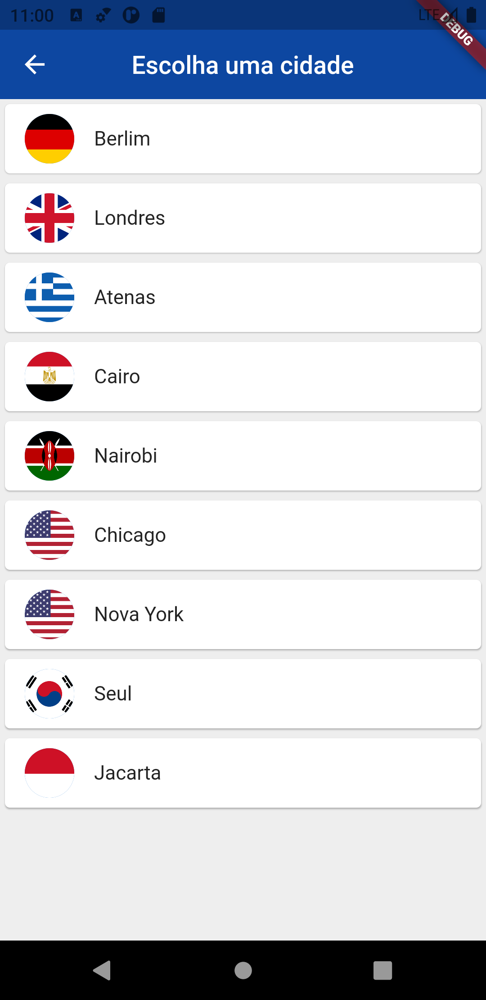

# flutter_time
This is a simple project that shows local time for some cities around the world. The app gets local time (UTC) from [World Time API](http://worldtimeapi.org/) and renders on the app screen. Of course the app could just save an UTC table for those cities and update based on users time, but it does not matter. This is just a toy project to learn a bit about Flutter and http package.

## day theme
This theme is used when is day in local time. 

## night theme
This theme is used when is night in local time. 

## selection screen
This is the selection screen.

